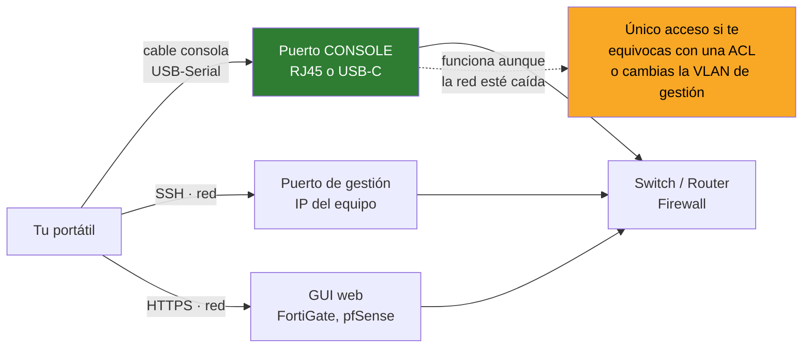
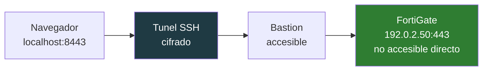

# 01 · Acceso a equipos

SSH · PuTTY · WinSCP · Tabby

---

## Cómo se llega a un equipo de red

Hay tres caminos, y elegir mal te deja fuera justo cuando más falta hace.



**La consola serie es el paracaídas.** El día que apliques una ACL mal escrita y pierdas el acceso SSH, el cable de consola es lo único que te queda. Nunca configures un equipo remoto crítico sin tener acceso físico disponible.

---

## OpenSSH

Viene con Windows. Es un cliente SSH completo: no necesitas nada más para el día a día.

### Uso básico

```powershell
ssh admin@192.0.2.10                 # conexión simple
ssh -p 2222 admin@192.0.2.10         # puerto no estándar
ssh admin@192.0.2.10 "show version"  # ejecutar y salir
```

### Claves en lugar de contraseñas

Más seguro y te ahorra teclear. La clave privada nunca sale de tu máquina.

```powershell
ssh-keygen -t ed25519 -C "mark@workstation"
# genera ~/.ssh/id_ed25519 (privada) y id_ed25519.pub (pública)

# copiar la pública al equipo (en Linux)
type $env:USERPROFILE\.ssh\id_ed25519.pub | ssh admin@192.0.2.10 "cat >> ~/.ssh/authorized_keys"
```

En un FortiGate o Cisco se pega la clave pública en la configuración del usuario.

### El fichero de configuración

`~/.ssh/config` convierte esto:

```powershell
ssh -p 2222 -i ~/.ssh/lab_key admin@192.0.2.10
```

en esto:

```powershell
ssh core-sw
```

```
Host core-sw
    HostName 192.0.2.10
    User admin
    Port 2222
    IdentityFile ~/.ssh/lab_key

Host *.lab
    User admin
    StrictHostKeyChecking no      # solo en laboratorio, nunca en produccion
```

### Equipos antiguos que rechazan la conexión

Switches viejos solo hablan algoritmos que OpenSSH moderno desactiva por inseguros. El error típico: `no matching key exchange method found`.

```powershell
ssh -o KexAlgorithms=+diffie-hellman-group1-sha1 `
    -o HostKeyAlgorithms=+ssh-rsa `
    -o Ciphers=+aes128-cbc admin@192.0.2.10
```

> Estás rebajando la seguridad a propósito. Hazlo solo contra equipos de tu red de gestión, y anota que ese switch necesita actualización de firmware.

### Túnel SSH: llegar a lo que no es accesible

Un equipo en una VLAN a la que no llegas, pero sí llegas a un bastión que sí:

```powershell
# el puerto 8443 local sale por el bastion hacia el FortiGate
ssh -L 8443:192.0.2.50:443 admin@bastion.ejemplo
# ahora abres https://localhost:8443 en el navegador
```



---

## PuTTY

Lo que hace que OpenSSH no: **conexión serie**.

### Consola serie

1. Conecta el cable USB-Serial. Windows le asigna un COM
2. Averigua cuál:

```powershell
Get-CimInstance Win32_SerialPort | Select-Object DeviceID, Description
# o
[System.IO.Ports.SerialPort]::GetPortNames()
```

3. En PuTTY: **Serial**, `COM3`, velocidad **9600**

| Vendor | Velocidad habitual |
|---|---|
| Cisco | 9600 |
| Fortinet | 9600 (algunos 115200) |
| MikroTik | 115200 |
| HPE / Aruba | 9600 |

Parámetros: **8 bits de datos, sin paridad, 1 bit de parada, sin control de flujo** (8N1).

> Si ves caracteres basura, la velocidad está mal. Prueba 115200.

### Guardar el log de la sesión

Imprescindible cuando documentas una intervención:

`Session → Logging → All session output`, y eliges el fichero.

### plink: PuTTY desde script

```powershell
plink -ssh admin@192.0.2.10 -pw CONTRASENA "show running-config" > backup.txt
```

> `-pw` deja la contraseña en el historial del shell. Usa claves.

---

## WinSCP

Transferencia de ficheros por **SFTP, SCP y FTP** con dos paneles.

Para qué en redes:

- Bajar la config de un firewall antes de tocarla
- Subir firmware a un equipo que acepte SCP
- Sacar logs de un servidor Linux

### Sincronizar una carpeta de backups

`Comandos → Sincronizar` compara local y remoto y solo copia lo que cambió.

### Desde línea de comandos

```powershell
& "C:\Program Files (x86)\WinSCP\WinSCP.com" /command `
    "open sftp://admin@192.0.2.10/ -privatekey=C:\Users\markp\.ssh\id_ed25519.ppk" `
    "get /var/log/messages C:\logs\" `
    "exit"
```

> WinSCP usa formato `.ppk`. Convierte tu clave OpenSSH con **PuTTYgen** (`Load` → `Save private key`).

---

## Tabby

Terminal con árbol de hosts. La ventaja sobre abrir diez PuTTY: **organización**.

### Cómo estructurar el inventario

Agrupa por función o ubicación, no alfabéticamente. Un nombre útil dice **rol, sitio y tipo**:

```
01 - PERIMETRO
     H1 | EDGE-A | firewall-a
     H2 | EDGE-B | firewall-b
02 - CORE
     SW1 | CORE | switch-core-a
```

Cuando hay una incidencia, el árbol te dice dónde mirar sin pensar.

### Perfiles

Cada host guarda su tipo (SSH, serie, local), credenciales o clave, y grupo. Se exporta todo en `%APPDATA%\tabby\config.yaml`.

> **Ese fichero lleva IPs, usuarios y a veces claves. Nunca lo subas a un repositorio público.** Está en el `.gitignore` de este repo por ese motivo.

### Detalle útil

Tabby trae **Clink** incrustado, que añade historial y autocompletado al `cmd.exe` de Windows. Por eso al abrir una pestaña cmd ves la cabecera de Clink.

### Cambiar el shell por defecto

`Settings → Profiles & connections → PowerShell → Set as default`. Recomendable: PowerShell 7 maneja UTF-8 y colores ANSI sin configurar nada.
