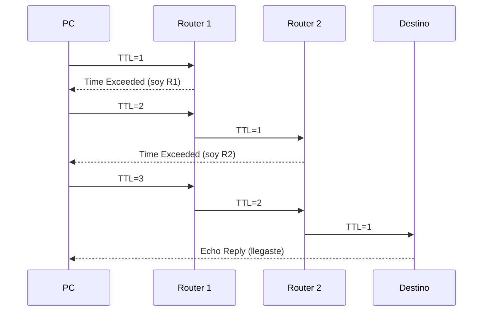
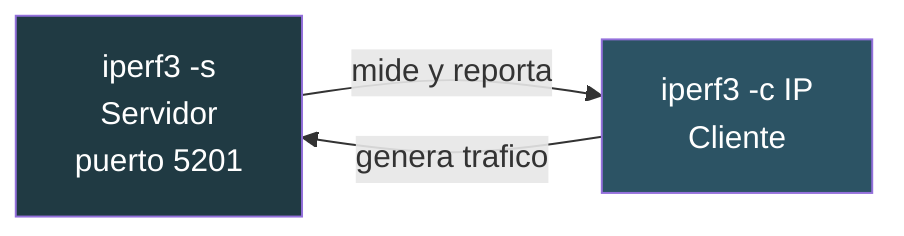

# 02 · Diagnóstico de red

ping · tracert · pathping · mtr · dig · netstat · arp · route · iperf3

---

## ping — ¿llega el paquete?

Manda un **ICMP Echo Request** y espera el Reply. Mide ida y vuelta (RTT).

```powershell
ping 192.0.2.1                    # 4 paquetes
ping -t 192.0.2.1                 # continuo, Ctrl+C para parar
ping -n 100 -l 1400 192.0.2.1     # 100 paquetes de 1400 bytes
ping -a 192.0.2.1                 # resuelve el nombre
```

### Encontrar el MTU real

Fragmentación prohibida (`-f`) y tamaño fijo (`-l`). Vas bajando hasta que pasa:

```powershell
ping -f -l 1472 192.0.2.1
# "Paquete necesita fragmentarse" -> baja el valor
```

1472 + 28 de cabeceras = **1500**, el MTU estándar de Ethernet. Si solo pasa con 1420, hay un túnel por medio (IPsec, GRE, PPPoE) comiéndose bytes. **Esta es la causa de la mitad de los «la VPN va pero algunas webs no cargan».**

### Cuando ping falla y la red está bien

Muchos firewalls y servidores Windows bloquean ICMP por defecto. **Que no responda al ping no significa que esté caído.** Comprueba con `Test-NetConnection` o `ncat` sobre un puerto que sí escuche.

```powershell
Test-NetConnection 192.0.2.10 -Port 443
```

---

## tracert — ¿por dónde va?

Manda paquetes con **TTL creciente**: 1, 2, 3... Cada router decrementa el TTL y, al llegar a 0, devuelve un ICMP *Time Exceeded* delatando su IP.



```powershell
tracert 8.8.8.8
tracert -d 8.8.8.8          # sin resolver nombres, mucho mas rapido
tracert -h 15 8.8.8.8       # maximo 15 saltos
```

### Cómo leerlo bien

**Un salto con `*` no es un fallo.** Muchos routers no responden a ICMP por política pero sí reenvían. Si los saltos posteriores contestan, ese router funciona.

**La latencia alta en un salto intermedio tampoco es el problema.** Responder a ICMP es baja prioridad para un router ocupado. Lo que importa es si la latencia **sigue alta hasta el final**.

---

## pathping — tracert con estadística

Traza la ruta y luego bombardea cada salto 100 veces para calcular **pérdida de paquetes por salto**. Tarda unos minutos.

```powershell
pathping -q 50 8.8.8.8      # 50 consultas por salto
```

Es la herramienta para «va lento a ratos» cuando necesitas una cifra que enseñar al ISP.

---

## mtr — el mejor de los tres (en WSL)

Combina ping y traceroute en una vista **que se actualiza en vivo**.

```bash
mtr 8.8.8.8                 # interactivo
mtr -r -c 100 8.8.8.8       # informe de 100 ciclos
mtr -T -P 443 192.0.2.10    # TCP al puerto 443 en vez de ICMP
```

El modo TCP (`-T`) es clave cuando el ICMP está filtrado: prueba con el protocolo real del servicio.

> En Windows la alternativa es WinMTR, **abandonado desde 2015**. Por eso `mtr` está en WSL.

---

## dig — DNS de verdad

`nslookup` responde «¿a qué IP resuelve?». `dig` responde **quién lo dice, con qué TTL y por qué cadena de delegación**.

```bash
dig ejemplo.com                    # consulta normal
dig ejemplo.com +short             # solo la respuesta
dig ejemplo.com MX                 # registros de correo
dig ejemplo.com @1.1.1.1           # preguntando a un servidor concreto
dig ejemplo.com +trace             # toda la delegacion desde los root
dig -x 192.0.2.10                  # DNS inverso
dig ejemplo.com SOA                # quien es la autoridad
```

### +trace: el que resuelve las dudas


Sirve para distinguir **«el DNS no resuelve»** de **«mi resolver tiene cacheada una respuesta vieja»**. Si `+trace` da la IP correcta pero tu equipo no, el problema es la caché local, no el DNS del dominio.

```powershell
ipconfig /flushdns        # limpiar cache DNS en Windows
```

### Comprobar propagación tras un cambio

```bash
for s in 1.1.1.1 8.8.8.8 9.9.9.9; do echo -n "$s: "; dig +short ejemplo.com @$s; done
```

---

## netstat y arp — qué pasa en tu máquina

```powershell
netstat -ano                       # todas las conexiones con PID
netstat -ano | findstr :443        # quien usa el 443
netstat -rn                        # tabla de rutas

arp -a                             # cache ARP: IP <-> MAC
arp -d                             # limpiarla
```

**La caché ARP delata problemas de capa 2.** Si una IP aparece con MAC `00-00-00-00-00-00` o cambia de MAC sola, hay duplicado de IP o un problema de VLAN.

Equivalentes modernos en PowerShell, con salida en objetos:

```powershell
Get-NetTCPConnection -State Listen | Select-Object LocalAddress, LocalPort, OwningProcess
Get-NetNeighbor                    # la tabla ARP
Get-NetRoute                       # las rutas
```

---

## route — la tabla de rutas

```powershell
route print                        # ver
route print -4                     # solo IPv4

# ruta estatica temporal (se pierde al reiniciar)
route add 198.51.100.0 mask 255.255.255.0 192.0.2.1

# permanente
route -p add 198.51.100.0 mask 255.255.255.0 192.0.2.1

route delete 198.51.100.0
```

Caso típico: conectado a la VPN corporativa, pierdes acceso a tu red local porque la VPN empuja una ruta por defecto. `route print` te lo muestra: hay dos `0.0.0.0` y gana la de métrica más baja.

---

## iperf3 — ancho de banda real

Ping mide latencia, no capacidad. `iperf3` genera tráfico y mide **throughput real**. Necesita **dos extremos**: servidor y cliente.



```powershell
# En el extremo servidor
iperf3 -s

# En el cliente
iperf3 -c 192.0.2.20                  # 10 s, TCP, un flujo
iperf3 -c 192.0.2.20 -t 30 -P 4       # 30 s con 4 flujos paralelos
iperf3 -c 192.0.2.20 -R               # al reves: mide bajada
iperf3 -c 192.0.2.20 -u -b 100M       # UDP a 100 Mbps: mide jitter y perdida
```

### Cómo interpretarlo

**Un solo flujo TCP rara vez llena un enlace rápido.** Con latencia alta, el tamaño de ventana TCP limita antes que el ancho de banda. Usa `-P 4` o `-P 8` para medir la capacidad real del enlace.

**UDP (`-u`) es lo que sirve para VoIP y vídeo**: te da jitter y porcentaje de pérdida, que es lo que degrada una llamada.

**Mide siempre en las dos direcciones.** Los enlaces asimétricos son la norma, y el problema suele estar solo en un sentido.

> Abre el 5201/TCP en el firewall del servidor, o la prueba fallará sin decirte por qué.
