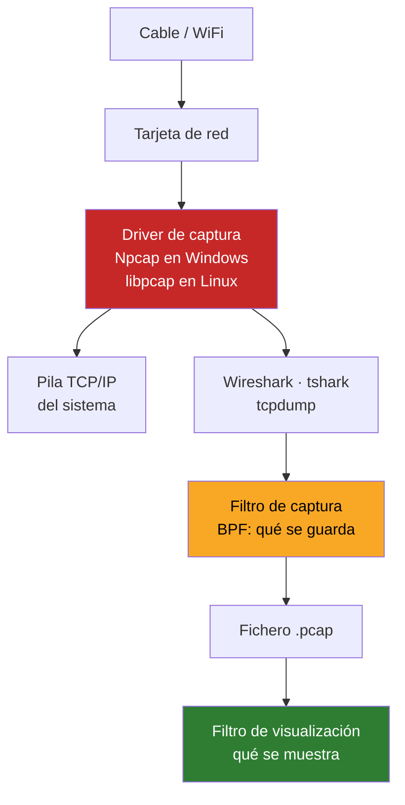
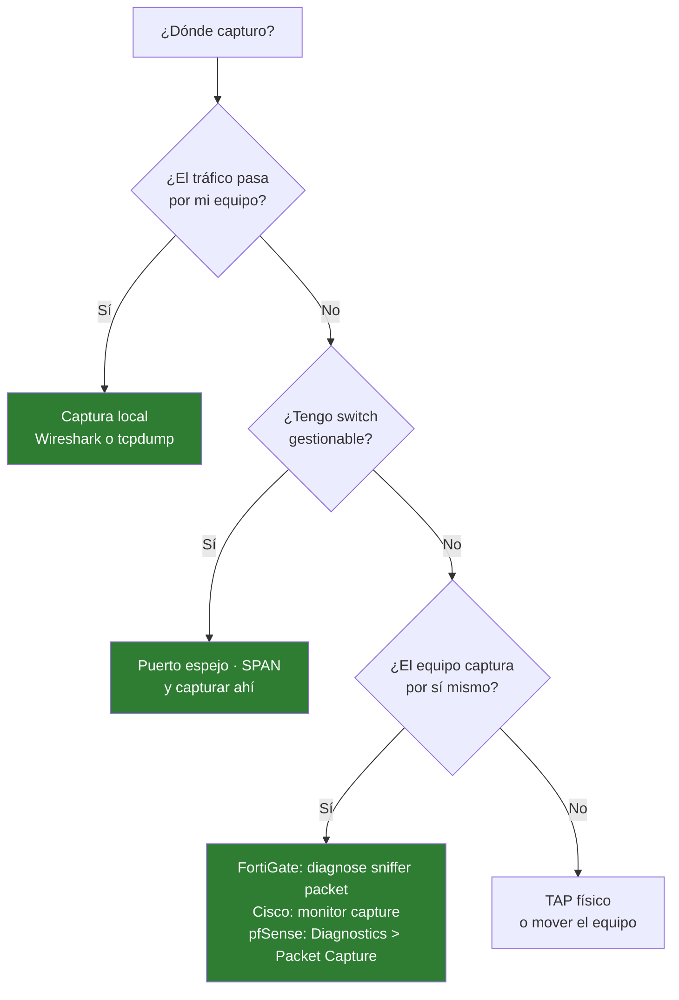

# 03 · Captura y análisis de tráfico

Npcap · Wireshark · tshark · tcpdump

---

## Cómo funciona una captura

Una tarjeta de red descarta por defecto todo lo que no va dirigida a ella. Capturar consiste en **pedirle que no lo haga** y en interceptar los paquetes antes de que el sistema operativo los procese.



**Npcap es la pieza crítica en Windows.** Sin él, Wireshark no captura nada. Por eso importa que esté en 1.x: la versión 0.99 falla en WiFi y loopback.

```powershell
Get-ItemProperty 'HKLM:\SOFTWARE\WOW6432Node\Microsoft\Windows\CurrentVersion\Uninstall\*' |
    Where-Object DisplayName -like '*Npcap*' | Select-Object DisplayName, DisplayVersion
```

---

## Los dos filtros: no los confundas

Es el error que más tiempo cuesta al empezar. **Son sintaxis distintas y momentos distintos.**

| | Filtro de **captura** | Filtro de **visualización** |
|---|---|---|
| Cuándo | Antes de guardar | Después, sobre lo guardado |
| Sintaxis | BPF | Wireshark |
| Ejemplo | `host 192.0.2.10 and port 443` | `ip.addr==192.0.2.10 && tcp.port==443` |
| Lo descartado | **Se pierde para siempre** | Sigue ahí, solo oculto |
| Para qué | Que el fichero no crezca sin control | Buscar dentro de lo capturado |

**Regla práctica:** captura amplio, filtra después. Solo usa filtro de captura cuando el volumen sea inmanejable — en un enlace saturado son gigas por minuto.

---

## Wireshark — el análisis visual

### Flujo de trabajo real

1. **Elige la interfaz** correcta. El gráfico de actividad al lado de cada una te dice cuál tiene tráfico
2. **Captura** mientras reproduces el problema. Nada más
3. **Para** en cuanto ocurra. Cuanto más pequeño el fichero, mejor
4. **Filtra** para encontrar la conversación
5. **Botón derecho → Follow → TCP Stream** para ver el diálogo completo

### Filtros de visualización que uso

```
ip.addr == 192.0.2.10                 todo de/hacia esa IP
tcp.port == 443                       puerto concreto
tcp.flags.syn==1 && tcp.flags.ack==0  intentos de conexión
tcp.analysis.retransmission           retransmisiones: síntoma de pérdida
tcp.analysis.zero_window              el receptor no da abasto
dns                                   solo DNS
http.request.method == "POST"
tls.handshake.type == 1               Client Hello: qué negocia el cliente
icmp
arp.duplicate-address-detected        IP duplicada en la red
!(arp || stp || cdp)                  quitar ruido de fondo
```

### Lo que delata cada síntoma

| Lo que ves | Lo que significa |
|---|---|
| Muchas **retransmisiones** | Pérdida de paquetes: cable, saturación, duplex mal negociado |
| **Zero Window** | El receptor tiene los búferes llenos. Problema del servidor, no de la red |
| **RST** justo tras el SYN | Nadie escucha en ese puerto, o un firewall corta |
| **SYN** sin respuesta | El paquete no llega o el firewall lo descarta en silencio |
| **TLS Alert** tras el Client Hello | Desajuste de versión o de cifrados. Típico con TLS 1.0 desactivado |
| **Tiempo alto entre petición y respuesta** | El problema es la aplicación, no la red |

### Herramientas del menú Statistics

| | |
|---|---|
| **Conversations** | Quién habla con quién y cuánto. Ordena por bytes y encuentras al que satura |
| **Protocol Hierarchy** | Reparto por protocolo. Un % raro de algo delata tráfico inesperado |
| **IO Graph** | Tráfico en el tiempo. Los picos se ven a simple vista |
| **Expert Information** | Wireshark ya ha marcado los problemas por ti. **Empieza por aquí** |

### Interpretar bien los tiempos

Cambia la columna Time a **Seconds Since Previous Displayed Packet** (`View → Time Display Format`). Así ves de un vistazo dónde está el hueco de dos segundos.

---

## tshark — Wireshark en terminal

El mismo motor sin interfaz. Para scripts, capturas largas y equipos sin escritorio.

```powershell
tshark -D                                          # listar interfaces
tshark -i 5                                        # capturar en la interfaz 5
tshark -i 5 -w captura.pcapng                      # a fichero
tshark -r captura.pcapng -Y "http.request"         # leer y filtrar
tshark -i 5 -a duration:60                         # parar a los 60 s
```

### Captura rotativa para dejarla horas

Diez ficheros de 100 MB en ciclo: nunca llena el disco y siempre tienes lo último.

```powershell
tshark -i 5 -b filesize:100000 -b files:10 -w ciclo.pcapng
```

Es la forma de cazar un problema intermitente: lo dejas corriendo y, cuando ocurre, paras y miras los últimos ficheros.

### Extraer campos concretos a CSV

```powershell
tshark -r captura.pcapng -T fields `
    -e frame.time -e ip.src -e ip.dst -e tcp.dstport `
    -E separator=, -E header=y > analisis.csv
```

### Consultas rápidas

```powershell
# top de IPs que más hablan
tshark -r captura.pcapng -q -z conv,ip

# todas las consultas DNS
tshark -r captura.pcapng -Y dns.flags.response==0 -T fields -e dns.qry.name | Sort-Object -Unique
```

---

## tcpdump — la captura en Linux (WSL)

No depende de Npcap. Es el estándar en cualquier servidor.

```bash
sudo tcpdump -i eth0                          # capturar
sudo tcpdump -i eth0 -nn                      # sin resolver nombres ni puertos
sudo tcpdump -i eth0 -w captura.pcap          # a fichero
sudo tcpdump -r captura.pcap                  # leer
sudo tcpdump -i eth0 -c 100                   # solo 100 paquetes
sudo tcpdump -i eth0 -s 0                     # paquete completo, sin truncar
```

### Filtros BPF

```bash
host 192.0.2.10                    # de o hacia esa IP
src host 192.0.2.10                # solo origen
net 192.0.2.0/24                   # una red
port 443
portrange 8000-8100
tcp and port 443 and host 192.0.2.10
'tcp[tcpflags] & tcp-syn != 0'     # solo SYN
not port 22                        # excluir tu propia sesión SSH
```

> **`not port 22` importa más de lo que parece.** Si capturas por SSH sin excluirlo, tu propia sesión genera tráfico que se captura, lo que genera más tráfico... Bucle.

### El flujo que mejor funciona

Capturar en Linux, analizar en Wireshark de Windows:

```bash
sudo tcpdump -i eth0 -nn -s 0 -w /mnt/c/Users/TU_USUARIO/Documents/captura.pcap
```

Escribe directo al disco de Windows: abres el fichero con doble clic. Y te saltas cualquier problema de driver en Windows.

---

## Dónde capturar

Tan importante como cómo. **Captura lo más cerca posible del problema.**



### Capturar en el propio equipo de red

```
# FortiGate — nivel 3 incluye cabeceras; 'a' captura de todas las interfaces
diagnose sniffer packet any "host 192.0.2.10" 4 0 a

# Cisco IOS-XE
monitor capture CAP interface GigabitEthernet0/1 both
monitor capture CAP match ipv4 any any
monitor capture CAP start
monitor capture CAP stop
show monitor capture CAP buffer brief
```

En pfSense está en `Diagnostics → Packet Capture`, y descarga el `.pcap` directamente.

---

## Higiene con los ficheros de captura

Un `.pcap` puede contener **credenciales en claro, cookies de sesión, correos y datos personales**.

- Nunca los subas a un repositorio. El `.gitignore` de este repo bloquea `*.pcap` y `*.pcapng`
- No los pases por servicios online de análisis si llevan datos de producción
- Bórralos cuando termines el análisis
- Si tienes que compartir uno, anonimízalo antes con `tracewrangler` o similar
