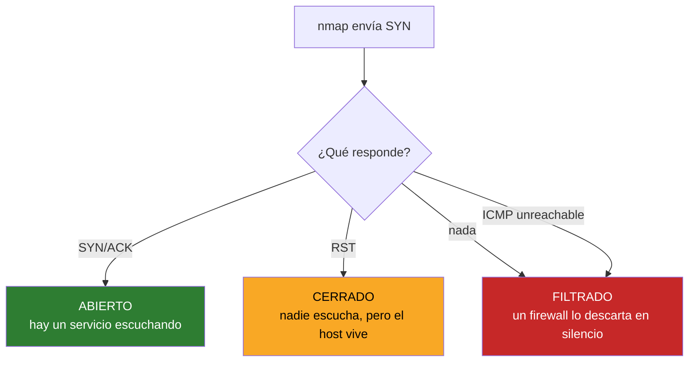
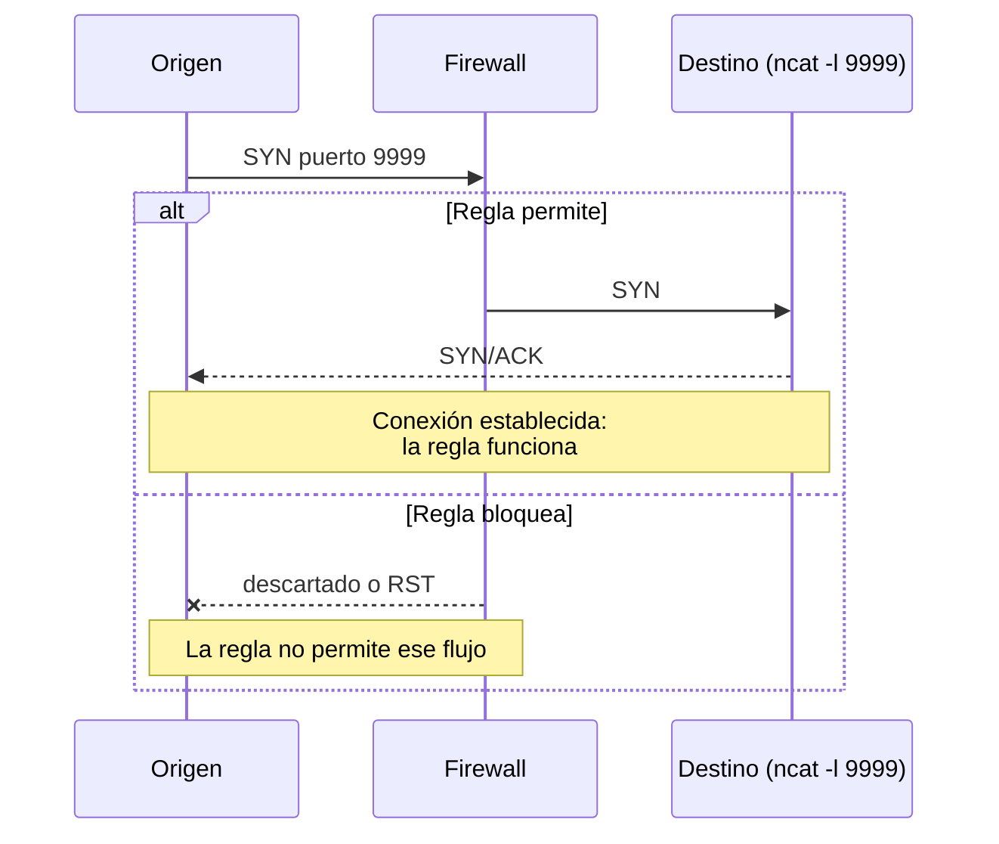

# 04 · Descubrimiento y pruebas de puerto

nmap · ncat · psping

> **Escanea solo redes que administras o para las que tienes autorización por escrito.** Un escaneo no autorizado puede ser delito y, además, dispara las alertas del SIEM de quien lo reciba.

---

## nmap — qué hay ahí fuera

### Cómo decide si un puerto está abierto

nmap no «pregunta»: manda un paquete y deduce del comportamiento de la respuesta.



La distinción **cerrado vs filtrado** es la información más útil: «cerrado» significa que llegaste al host y no hay servicio; «filtrado» significa que algo por el camino te corta. Diagnósticos completamente distintos.

### Descubrimiento de hosts

```powershell
nmap -sn 192.0.2.0/24              # solo ping scan: qué vive, sin tocar puertos
nmap -sn -PR 192.0.2.0/24          # por ARP: más fiable y rápido en red local
nmap -sL 192.0.2.0/24              # solo listar, sin mandar nada
```

`-sn` es el inventario rápido: en segundos sabes cuántos equipos hay en la VLAN.

### Escaneo de puertos

```powershell
nmap 192.0.2.10                    # los 1000 más comunes
nmap -p- 192.0.2.10                # los 65535
nmap -p 22,80,443 192.0.2.10       # puertos concretos
nmap -sU -p 161,162 192.0.2.10     # UDP: SNMP
nmap -F 192.0.2.10                 # rápido: los 100 más comunes
```

### Identificación

```powershell
nmap -sV 192.0.2.10                # versión de cada servicio
nmap -O 192.0.2.10                 # sistema operativo (requiere admin)
nmap -A 192.0.2.10                 # todo: versión, SO, scripts, traceroute
```

`-sV` es lo que convierte «el 443 está abierto» en «nginx 1.24 con OpenSSL 3.0». Para inventario y para detectar versiones obsoletas, es lo que importa.

### Velocidad y prudencia

```powershell
nmap -T4 192.0.2.0/24              # rápido: bien en LAN
nmap -T2 192.0.2.10                # lento y discreto
nmap --top-ports 20 192.0.2.0/24   # solo los 20 más habituales
```

> `-T5` puede tirar equipos antiguos o saturar un firewall pequeño. En producción no pases de `-T3`.

### Scripts NSE

```powershell
nmap --script ssl-enum-ciphers -p 443 192.0.2.10    # cifrados y versiones TLS
nmap --script ssh2-enum-algos -p 22 192.0.2.10      # algoritmos SSH
nmap --script snmp-info -sU -p 161 192.0.2.10       # info por SNMP
nmap --script vuln 192.0.2.10                       # vulnerabilidades conocidas
nmap --script banner -p 22,80,443 192.0.2.10
```

`ssl-enum-ciphers` es el que más uso: te dice qué versiones de TLS acepta un servicio y les pone nota. Perfecto para auditar un portal tras cambiar el certificado.

### Guardar resultados

```powershell
nmap -sV 192.0.2.0/24 -oN escaneo.txt      # legible
nmap -sV 192.0.2.0/24 -oX escaneo.xml      # XML
nmap -sV 192.0.2.0/24 -oG escaneo.gnmap    # grepeable
nmap -sV 192.0.2.0/24 -oA escaneo          # los tres a la vez
```

`-oA` antes y después de un cambio te da un diff del inventario.

### Comparar dos escaneos

```powershell
ndiff antes.xml despues.xml
```

Contesta «¿qué ha cambiado en esta red desde el mes pasado?». Un puerto nuevo abierto que nadie justifica es una señal.

---

## ncat — la navaja suiza de TCP/UDP

Viene con nmap. Abre, escucha y conecta sockets a mano.

### Probar si un puerto responde

```powershell
ncat -zv 192.0.2.10 443            # -z solo comprueba, -v informa
ncat -zv 192.0.2.10 20-25          # un rango
```

Más fiable que ping cuando el ICMP está filtrado: prueba el puerto real del servicio.

### Ver el banner de un servicio

```powershell
ncat 192.0.2.10 22                 # el servidor SSH se identifica solo
ncat 192.0.2.10 25                 # SMTP
```

### Probar conectividad de extremo a extremo

Para verificar que una regla de firewall funciona necesitas algo escuchando al otro lado:

```powershell
# En el destino
ncat -l 9999

# Desde el origen
ncat 192.0.2.20 9999
# escribes y debe aparecer en el otro lado
```



Esto es lo que se usa para **validar una política de firewall recién escrita** sin tener que desplegar el servicio real.

### Transferir un fichero sin servidor

```powershell
# receptor
ncat -l 9999 > recibido.bin

# emisor
ncat 192.0.2.20 9999 < fichero.bin
```

> Va en claro. Solo en red de gestión y para cosas que no sean sensibles.

---

## psping — latencia de verdad (Sysinternals)

Ping por **TCP**, no por ICMP. Mide lo que mide tu aplicación.

```powershell
psping 192.0.2.10:443              # latencia TCP al 443
psping -n 100 192.0.2.10:443       # 100 intentos
psping -b 192.0.2.10:443           # prueba de ancho de banda
psping -l 8k -n 100 192.0.2.10:443 # con paquetes de 8 KB
```

Por qué importa: los routers tratan el ICMP con baja prioridad, así que `ping` puede dar 2 ms mientras una conexión TCP real tarda 80. `psping` mide el camino que recorre tu tráfico de verdad.

| Herramienta | Protocolo | Para qué |
|---|---|---|
| `ping` | ICMP | ¿Está vivo? |
| `psping` | TCP | ¿Cuánto tarda de verdad el servicio? |
| `Test-NetConnection` | TCP | Lo mismo, nativo en PowerShell |
| `ncat -zv` | TCP/UDP | ¿Está abierto? Sí o no |

---

## Test-NetConnection — el nativo de PowerShell

Sin instalar nada:

```powershell
Test-NetConnection 192.0.2.10 -Port 443
Test-NetConnection 192.0.2.10 -TraceRoute
Test-NetConnection -ComputerName ejemplo.com -InformationLevel Detailed
```

Devuelve objetos, así que encadena bien:

```powershell
# comprobar un puerto en varios equipos
'192.0.2.10','192.0.2.11','192.0.2.12' | ForEach-Object {
    $r = Test-NetConnection $_ -Port 443 -WarningAction SilentlyContinue
    "{0,-15} {1}" -f $_, $(if ($r.TcpTestSucceeded) { 'OK' } else { 'FALLA' })
}
```
