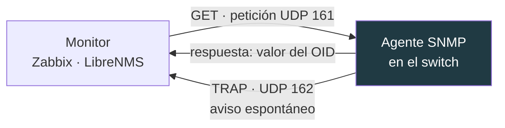
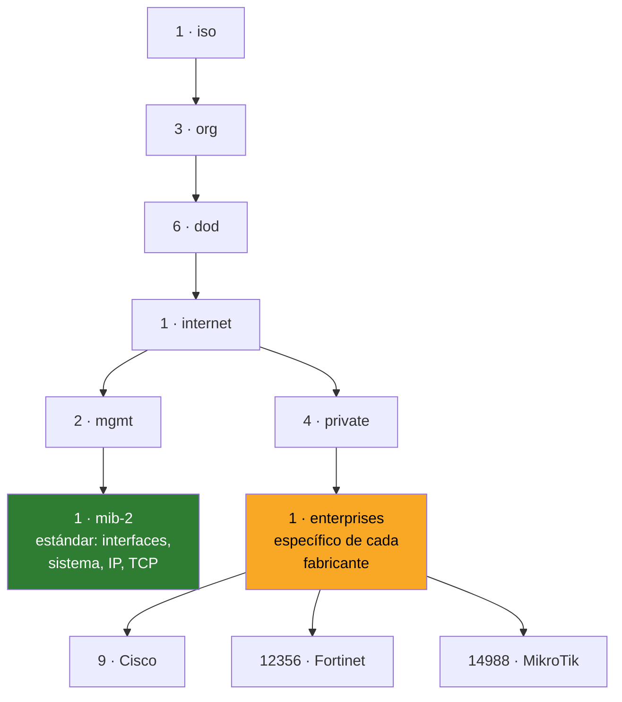

# 05 · SNMP

snmpwalk · snmpget · MIBs

---

## Qué es SNMP y por qué importa

Es el protocolo con el que un switch, router o AP te cuenta su estado: tráfico por interfaz, temperatura, CPU, errores CRC. **Es lo que hay debajo de Zabbix, LibreNMS, PRTG y cualquier monitorización de red.**

Antes de dar de alta un host en Zabbix, se comprueba a mano con `snmpwalk`. Si no responde por consola, tampoco responderá desde el monitor.



Dos flujos distintos: el monitor **pregunta** (GET/WALK, puerto 161) y el equipo **avisa** por su cuenta cuando pasa algo (TRAP, puerto 162).

---

## OIDs y MIBs

Un **OID** es la dirección de un dato, en forma de árbol numérico:

```
1.3.6.1.2.1.2.2.1.2.1
```

Ilegible. Una **MIB** es el diccionario que lo traduce:

```
IF-MIB::ifDescr.1
```

Ambos apuntan al mismo sitio: la descripción de la interfaz 1.



La rama `mib-2` es **estándar**: funciona igual en Cisco, Fortinet o MikroTik. La rama `enterprises` es propia de cada fabricante — ahí están las métricas interesantes (sesiones del firewall, estado del cluster HA) pero no son portables.

### Instalar las MIBs

Sin ellas, `snmpwalk` devuelve números. Con ellas, nombres:

```bash
sudo apt install -y snmp snmp-mibs-downloader

# si sigue mostrando números, están desactivadas por defecto
sudo sed -i 's/^mibs :/# mibs :/' /etc/snmp/snmp.conf
```

---

## snmpwalk — recorrer el árbol

```bash
# v2c, el más habitual en equipos de red
snmpwalk -v2c -c COMUNIDAD 192.0.2.10

# una rama concreta
snmpwalk -v2c -c COMUNIDAD 192.0.2.10 IF-MIB::ifDescr

# v3 con autenticación y cifrado
snmpwalk -v3 -l authPriv -u USUARIO -a SHA -A CLAVE_AUTH -x AES -X CLAVE_PRIV 192.0.2.10

# forzar números en vez de nombres
snmpwalk -v2c -c COMUNIDAD -On 192.0.2.10
```

### Lo primero que se consulta siempre

```bash
# ¿quién eres?
snmpwalk -v2c -c COMUNIDAD 192.0.2.10 SNMPv2-MIB::sysDescr

# ¿cuánto llevas encendido?
snmpwalk -v2c -c COMUNIDAD 192.0.2.10 SNMPv2-MIB::sysUpTime

# lista de interfaces
snmpwalk -v2c -c COMUNIDAD 192.0.2.10 IF-MIB::ifDescr

# estado up/down de cada una
snmpwalk -v2c -c COMUNIDAD 192.0.2.10 IF-MIB::ifOperStatus
```

### Los OIDs estándar que se usan a diario

| OID | Qué es |
|---|---|
| `SNMPv2-MIB::sysDescr` | Modelo y versión de firmware |
| `SNMPv2-MIB::sysName` | Hostname configurado |
| `SNMPv2-MIB::sysUpTime` | Tiempo encendido |
| `IF-MIB::ifDescr` | Nombre de cada interfaz |
| `IF-MIB::ifOperStatus` | 1 = up, 2 = down |
| `IF-MIB::ifSpeed` | Velocidad negociada |
| `IF-MIB::ifHCInOctets` | Bytes recibidos, contador de 64 bits |
| `IF-MIB::ifHCOutOctets` | Bytes enviados, 64 bits |
| `IF-MIB::ifInErrors` | Errores de entrada |

> **Usa siempre los contadores `ifHC*` de 64 bits.** Los de 32 bits (`ifInOctets`) desbordan en minutos en un enlace de 1 Gbps, y las gráficas salen con picos absurdos.

---

## snmpget — un solo valor

Cuando ya sabes el OID exacto, `snmpget` es más rápido que recorrer el árbol:

```bash
snmpget -v2c -c COMUNIDAD 192.0.2.10 SNMPv2-MIB::sysName.0
```

> Fíjate en el `.0` final. Los objetos escalares —los que tienen un único valor— se piden con índice `.0`. Es el error más común al empezar.

---

## Calcular tráfico real

SNMP no te da «Mbps»: te da un **contador acumulado de bytes**. El ancho de banda se calcula con dos lecturas.

```bash
# lectura 1
snmpget -v2c -c COMUNIDAD 192.0.2.10 IF-MIB::ifHCInOctets.1
sleep 10
# lectura 2
snmpget -v2c -c COMUNIDAD 192.0.2.10 IF-MIB::ifHCInOctets.1
```

```
Mbps = (bytes2 - bytes1) * 8 / segundos / 1.000.000
```

Eso es exactamente lo que hacen Zabbix y LibreNMS por debajo, cada 60 segundos.

---

## Configurar SNMP en los equipos

```
# Cisco IOS — v2c de solo lectura, restringido por ACL
snmp-server community COMUNIDAD RO 10
access-list 10 permit 192.0.2.100

# Cisco IOS — v3, lo recomendable
snmp-server group MONITOR v3 priv
snmp-server user monitor MONITOR v3 auth sha CLAVE_AUTH priv aes 128 CLAVE_PRIV
```

```
# MikroTik RouterOS
/snmp community set [find default=yes] name=COMUNIDAD addresses=192.0.2.100/32
/snmp set enabled=yes
```

En FortiGate se hace desde `System → SNMP`, creando una comunidad v2c o un usuario v3 y **limitando siempre el host origen**.

---

## Seguridad: esto no es un detalle

**SNMPv1 y v2c no cifran nada.** La comunidad viaja en claro por la red. Cualquiera con un `tcpdump` la captura.

Y `public` es la comunidad por defecto de medio mundo: un escaneo con `nmap --script snmp-info` encuentra equipos con ella en cualquier red mal mantenida.

| Regla | Por qué |
|---|---|
| **Nunca `public` ni `private`** | Son las primeras que prueba cualquier escáner |
| **Solo lectura salvo que necesites escribir** | Con SNMP de escritura se puede reconfigurar el equipo |
| **Restringe por IP origen** | ACL con la IP del monitor y nada más |
| **v3 donde se pueda** | Es el único que autentica y cifra |
| **SNMP solo en la VLAN de gestión** | Nunca expuesto a la red de usuarios |

### Comprobar si tienes equipos expuestos

```powershell
nmap -sU -p 161 --script snmp-info 192.0.2.0/24
```

Si alguno responde con la comunidad por defecto, tienes un hallazgo de auditoría.

---

## Del diagnóstico a la monitorización

`snmpwalk` sirve para verificar y depurar. Para vigilar 24/7 necesitas un recolector:

| Herramienta | Dónde | Nota |
|---|---|---|
| **snmp_exporter** | Docker en el portátil | Traduce SNMP a métricas Prometheus |
| **mktxp** | Docker en el portátil | Exporter específico de MikroTik |
| **Zabbix** · **LibreNMS** | [homelab](https://github.com/marksato13/homelab) | Servidores 24/7 con base de datos |
