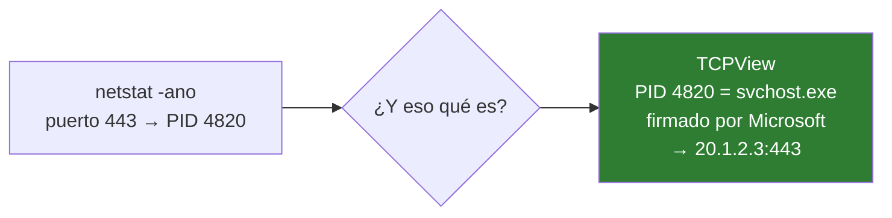

# 06 · Sistema y procesos

TCPView · Process Explorer · PsTools

Herramientas de Sysinternals. Contestan la pregunta que `netstat` deja a medias: **no qué puerto está abierto, sino quién lo abrió y por qué.**

---

## TCPView

`netstat -ano` te da un PID. TCPView te da el proceso, su ruta, su firma y el tráfico en tiempo real, con las filas nuevas en verde y las que se cierran en rojo.



### Para qué lo uso

**Un puerto abierto que no reconozco.** Ordenas por *Local Port*, lo encuentras, y con botón derecho → *Process Properties* ves la ruta y la firma digital.

**Una aplicación que «no conecta».** Filtras por su nombre y ves si llega a hacer el SYN o ni lo intenta. Si no aparece nada, el problema es la aplicación, no la red.

**Tráfico saliente inesperado.** Ordenas por *Sent Bytes* y ves quién está subiendo datos.

### Estados que importan

| Estado | Significado |
|---|---|
| `LISTENING` | Hay un servicio esperando conexiones |
| `ESTABLISHED` | Conexión activa |
| `TIME_WAIT` | Cerrada hace poco. Normal, desaparece en unos segundos |
| `SYN_SENT` | **Pidió conectar y no le responden.** Firewall o servicio caído |
| `CLOSE_WAIT` | Muchos de estos indican un bug de la aplicación: no cierra sus sockets |

`SYN_SENT` acumulándose es la firma exacta de «un firewall descarta en silencio».

### tcpvcon: la versión para scripts

```powershell
tcpvcon -a -c           # todas las conexiones en CSV
tcpvcon -a -c | Select-String "443"
```

---

## Process Explorer

El Administrador de tareas con la información que falta: árbol de procesos, qué DLL carga cada uno, qué ficheros y claves de registro tiene abiertos.

### Lo que más resuelve

**«No puedo borrar este fichero, está en uso».** `Find → Find Handle or DLL`, escribes el nombre del fichero y te dice qué proceso lo retiene.

**Un proceso desconocido.** Botón derecho → *Check VirusTotal* consulta el hash (no sube el fichero) y te devuelve cuántos motores lo marcan.

**Árbol de procesos.** Muestra quién lanzó a quién. Un `powershell.exe` colgando de un `winword.exe` es una señal de alarma clara.

### Configurarlo bien la primera vez

1. `Options → Verify Image Signatures` — añade la columna de firma digital
2. `Options → VirusTotal.com → Check VirusTotal.com`
3. `Options → Replace Task Manager` — que Ctrl+Shift+Esc abra este

Con la verificación de firmas activada, un proceso sin firmar en `C:\Windows\System32` salta a la vista.

### Colores

| Color | Qué es |
|---|---|
| Rosa | Servicio |
| Morado | Imagen comprimida o empaquetada — **frecuente en malware** |
| Verde | Proceso recién creado |
| Rojo | Proceso terminando |

---

## PsTools

Colección de utilidades de línea de comandos. Las que uso:

### psping

Ping por TCP. Ya cubierto en [04 · Descubrimiento](04-descubrimiento.md).

```powershell
psping 192.0.2.10:443 -n 100
```

### pslist

```powershell
pslist                     # procesos con CPU y memoria
pslist -t                  # en árbol
pslist nombre              # uno concreto
```

### psexec

Ejecuta comandos en equipos remotos.

```powershell
psexec \\192.0.2.20 ipconfig /all
psexec \\192.0.2.20 -s cmd          # como SYSTEM en el equipo remoto
```

> **Trátalo con respeto.** `psexec` es una herramienta legítima de administración que además usa habitualmente el malware para moverse lateralmente. Tu propio EDR puede bloquearlo, y con razón. Úsalo solo en equipos que administras, y no te sorprendas si salta una alerta.

### psloggedon y psinfo

```powershell
psloggedon \\192.0.2.20    # quién tiene sesión iniciada
psinfo \\192.0.2.20        # versión de SO, uptime, parches
```

`psinfo` es rápido para inventariar un parque pequeño sin desplegar nada.

---

## Los equivalentes nativos de PowerShell

Sysinternals aporta profundidad, pero para scripts PowerShell devuelve objetos, que encadenan mejor:

```powershell
# conexiones en escucha con el nombre del proceso
Get-NetTCPConnection -State Listen | ForEach-Object {
    [pscustomobject]@{
        Puerto  = $_.LocalPort
        Proceso = (Get-Process -Id $_.OwningProcess -ErrorAction SilentlyContinue).ProcessName
        PID     = $_.OwningProcess
    }
} | Sort-Object Puerto

# quién consume CPU
Get-Process | Sort-Object CPU -Descending | Select-Object -First 10 Name, CPU, WS

# procesos sin firmar fuera de las rutas habituales
Get-Process | Where-Object Path | ForEach-Object {
    $s = Get-AuthenticodeSignature $_.Path -ErrorAction SilentlyContinue
    if ($s.Status -ne 'Valid') { "{0,-25} {1}" -f $_.ProcessName, $_.Path }
}
```

Ese último es una comprobación de higiene rápida: lista todo lo que corre sin firma digital válida.
