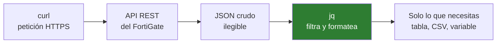

# 07 · Datos y criptografía

jq · OpenSSL · curl

Estas tres son las que convierten «trastear por la GUI» en «automatizar contra la API».

---

## curl + jq — hablar con las APIs de los equipos

Los firewalls y controladores modernos exponen API REST. FortiGate, pfSense, Meraki, UniFi: todos devuelven JSON.



### curl: lo esencial

```powershell
curl.exe -s https://ejemplo.com                      # silencioso
curl.exe -I https://ejemplo.com                      # solo cabeceras
curl.exe -k https://192.0.2.50                       # ignorar cert autofirmado
curl.exe -v https://ejemplo.com                      # verboso: ver el handshake
curl.exe -X POST -d '{"a":1}' -H "Content-Type: application/json" URL
curl.exe -H "Authorization: Bearer TOKEN" URL
curl.exe -o fichero.bin URL                          # descargar
curl.exe -w "%{time_total}\n" -o NUL -s URL          # medir cuánto tarda
```

> En PowerShell escribe **`curl.exe`**, no `curl` a secas: `curl` es un alias de `Invoke-WebRequest` y acepta otros parámetros.

### jq: filtrar JSON

```powershell
cat datos.json | jq .                        # formatear e indentar
jq '.results' datos.json                     # una clave
jq '.results[]' datos.json                   # recorrer el array
jq '.results[].name' datos.json              # un campo de cada elemento
jq -r '.results[].name' datos.json           # -r: sin comillas
jq '.results | length' datos.json            # cuántos hay
jq '.results[] | select(.status=="up")' datos.json      # filtrar
jq '.results[] | {nombre:.name, ip:.ip}' datos.json     # remodelar
jq -r '.results[] | [.name,.ip] | @csv' datos.json      # a CSV
```

### Ejemplo real: interfaces de un FortiGate

```powershell
$fg    = "192.0.2.50"
$token = $env:FGT_TOKEN          # nunca en el script

curl.exe -sk -H "Authorization: Bearer $token" `
    "https://$fg/api/v2/monitor/system/interface" |
    jq -r '.results | to_entries[] | [.key, .value.link, .value.speed] | @tsv'
```

Devuelve una tabla de interfaz, estado y velocidad. Eso mismo, en bucle sobre veinte firewalls, es un inventario en treinta segundos.

> **El token va en una variable de entorno, nunca escrito en el script.** Un token de API en un repositorio es una credencial filtrada.

---

## OpenSSL — certificados

El 90 % del uso en redes es una de estas cuatro cosas.

### 1. Inspeccionar el certificado de un servicio

```powershell
openssl s_client -connect 192.0.2.50:443 -servername portal.ejemplo.com
```

Con el resumen legible:

```powershell
openssl s_client -connect ejemplo.com:443 2>$null | openssl x509 -noout -text
```

Solo lo importante:

```powershell
openssl s_client -connect ejemplo.com:443 2>$null |
    openssl x509 -noout -subject -issuer -dates
```

### 2. ¿Cuándo caduca?

```powershell
openssl s_client -connect ejemplo.com:443 2>$null | openssl x509 -noout -enddate
```

En bucle sobre tus servicios, es un aviso de caducidad casero:

```powershell
'portal.ejemplo.com','vpn.ejemplo.com' | ForEach-Object {
    $f = openssl s_client -connect "${_}:443" 2>$null | openssl x509 -noout -enddate
    "{0,-25} {1}" -f $_, $f
}
```

### 3. Generar un CSR para una SSL-VPN

```powershell
# clave privada
openssl genrsa -out vpn.key 2048

# petición de firma
openssl req -new -key vpn.key -out vpn.csr `
    -subj "/C=PE/ST=Lima/L=Lima/O=Organizacion/CN=vpn.ejemplo.com"

# comprobar antes de mandarlo
openssl req -in vpn.csr -noout -text
```

Con SAN (obligatorio en navegadores modernos):

```powershell
openssl req -new -key vpn.key -out vpn.csr `
    -subj "/CN=vpn.ejemplo.com" `
    -addext "subjectAltName=DNS:vpn.ejemplo.com,DNS:vpn2.ejemplo.com"
```

> **Un certificado sin SAN lo rechazan Chrome y Firefox** aunque el CN sea correcto. Es la causa número uno de «el certificado está bien pero da error».

### 4. Verificar que la clave y el certificado se corresponden

Antes de subirlos a un FortiGate, comprueba que son pareja. Los tres módulos deben dar el mismo hash:

```powershell
openssl x509 -noout -modulus -in cert.crt | openssl md5
openssl rsa  -noout -modulus -in vpn.key  | openssl md5
openssl req  -noout -modulus -in vpn.csr  | openssl md5
```

Si no coinciden, el equipo rechazará la importación sin explicar el motivo.

### Conversión de formatos

Cada fabricante quiere el suyo:

```powershell
# PEM -> PFX (para Windows y algunos equipos)
openssl pkcs12 -export -out cert.pfx -inkey vpn.key -in cert.crt -certfile cadena.crt

# PFX -> PEM
openssl pkcs12 -in cert.pfx -out cert.pem -nodes

# DER -> PEM
openssl x509 -inform der -in cert.der -out cert.pem
```

### Auditar qué TLS acepta un servicio

```powershell
openssl s_client -connect ejemplo.com:443 -tls1_2
openssl s_client -connect ejemplo.com:443 -tls1_3
```

Si conecta con `-tls1` o `-tls1_1`, tienes un hallazgo: esas versiones están obsoletas.

Más completo, con nota incluida:

```powershell
nmap --script ssl-enum-ciphers -p 443 ejemplo.com
```

---

## Los tres juntos

Sacar el inventario de certificados de varios servicios a un CSV:

```powershell
$hosts = 'portal.ejemplo.com','vpn.ejemplo.com','correo.ejemplo.com'

$hosts | ForEach-Object {
    $txt = openssl s_client -connect "${_}:443" 2>$null |
           openssl x509 -noout -subject -issuer -enddate
    [pscustomobject]@{
        Host    = $_
        Emisor  = ($txt | Select-String '^issuer=') -replace '^issuer=',''
        Caduca  = ($txt | Select-String '^notAfter=') -replace '^notAfter=',''
    }
} | Export-Csv certificados.csv -NoTypeInformation -Encoding UTF8
```

De aquí a un aviso automático por correo hay un paso. Y renovar un certificado caducado con aviso es rutina; hacerlo con el servicio caído, no.
