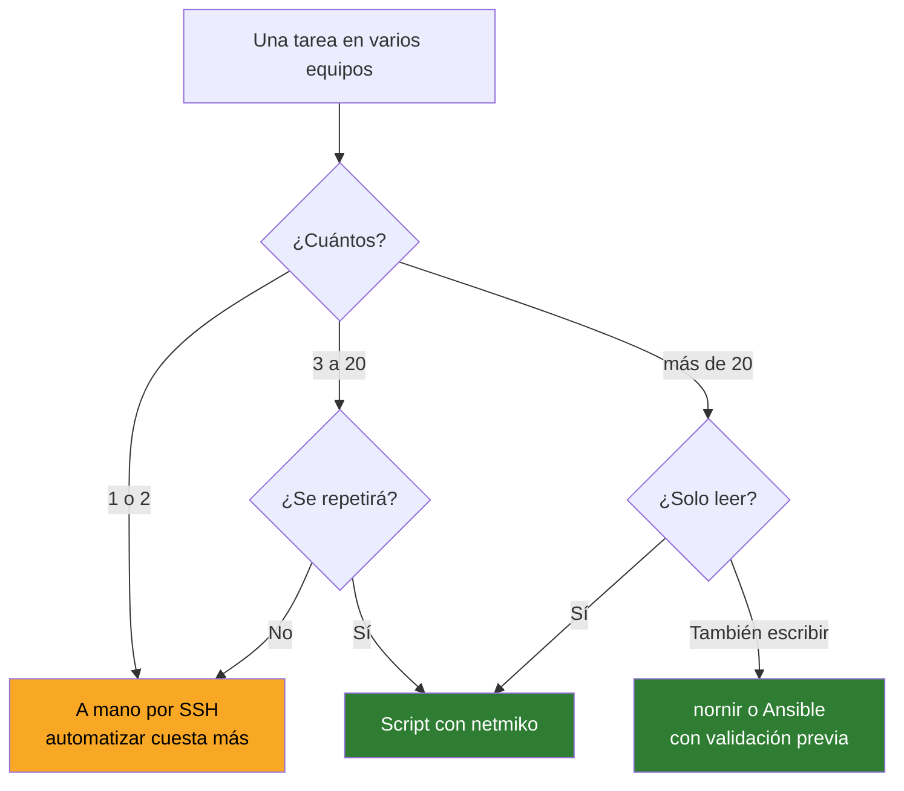
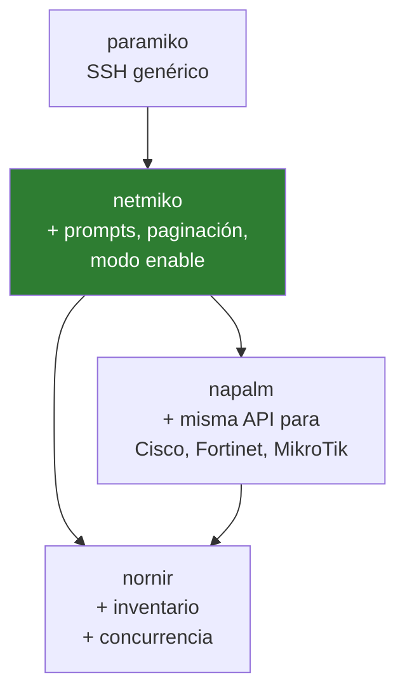

# 08 · Automatización

Python · netmiko · napalm · nornir · Ansible

---

## Cuándo automatizar

No siempre compensa. La regla honesta:



Y una regla de seguridad que no se negocia: **primero leer, luego escribir**. Un script que solo consulta no puede tirar la red. Empieza por inventarios y auditorías; los cambios masivos vienen después, cuando confías en tu propio código.

---

## Las capas

| Herramienta | Qué aporta | Cuándo |
|---|---|---|
| **paramiko** | SSH crudo en Python | Casi nunca directamente |
| **netmiko** | SSH que entiende de equipos de red | El 80 % de los casos |
| **napalm** | Abstrae el vendor: el mismo código para todos | Multi-fabricante |
| **nornir** | Inventario + concurrencia | Muchos equipos a la vez |
| **Ansible** | Declarativo, en YAML | Cambios de configuración en producción |



**Qué resuelve netmiko que paramiko no:** los equipos de red pagina la salida (`--More--`), tienen prompts que cambian según el modo, requieren `enable`, y cada vendor lo hace distinto. netmiko gestiona todo eso.

---

## netmiko

```powershell
python -m venv .venv
.\.venv\Scripts\Activate.ps1
pip install netmiko
```

### Leer de un equipo

```python
from netmiko import ConnectHandler
import os

equipo = {
    "device_type": "cisco_ios",
    "host": "192.0.2.10",
    "username": os.environ["NET_USER"],      # nunca literales en el codigo
    "password": os.environ["NET_PASS"],
}

with ConnectHandler(**equipo) as con:
    print(con.send_command("show version"))
```

`device_type` habituales: `cisco_ios`, `cisco_nxos`, `fortinet`, `mikrotik_routeros`, `hp_procurve`, `juniper_junos`, `linux`.

### Inventario de varios equipos a CSV

El primer script útil de verdad: recorre la lista y saca modelo y versión.

```python
from netmiko import ConnectHandler
import os, csv

HOSTS = ["192.0.2.10", "192.0.2.11", "192.0.2.12"]

with open("inventario.csv", "w", newline="", encoding="utf-8") as f:
    w = csv.writer(f)
    w.writerow(["host", "hostname", "version"])

    for host in HOSTS:
        try:
            with ConnectHandler(device_type="cisco_ios", host=host,
                                username=os.environ["NET_USER"],
                                password=os.environ["NET_PASS"]) as con:
                salida = con.send_command("show version")
                w.writerow([host, con.find_prompt().strip("#>"), salida.splitlines()[0]])
                print(f"OK    {host}")
        except Exception as e:
            print(f"FALLA {host}: {e}")
```

> El `try/except` no es opcional. Con veinte equipos, alguno estará apagado, y sin capturar la excepción el script muere en el tercero.

### Backup de configuraciones

```python
from datetime import date

with ConnectHandler(**equipo) as con:
    cfg = con.send_command("show running-config")

nombre = f"{equipo['host']}_{date.today():%Y%m%d}.cfg"
open(nombre, "w", encoding="utf-8").write(cfg)
```

> Ese fichero lleva IPs, comunidades SNMP y a veces hashes de contraseñas. El `.gitignore` de este repo bloquea `configs/` y `backups/` por eso.

### Aplicar cambios

```python
comandos = [
    "interface GigabitEthernet0/2",
    "description ENLACE-NUEVO",
    "no shutdown",
]

with ConnectHandler(**equipo) as con:
    print(con.send_config_set(comandos))
    print(con.save_config())          # write memory
```

**Prueba siempre en un equipo antes de lanzarlo contra los veinte.** Y ten el acceso por consola disponible.

---

## napalm

Cuando el parque es multi-fabricante, napalm devuelve **la misma estructura de datos** venga de donde venga.

```python
from napalm import get_network_driver
import os

driver = get_network_driver("ios")
with driver("192.0.2.10", os.environ["NET_USER"], os.environ["NET_PASS"]) as d:
    print(d.get_facts())          # modelo, serie, uptime, interfaces
    print(d.get_interfaces())
    print(d.get_arp_table())
    print(d.get_bgp_neighbors())
```

Misma llamada contra un Junos o un NX-OS: misma salida. Eso es lo que permite escribir un informe que funcione en toda la red.

### Lo mejor de napalm: commit y rollback

```python
with driver("192.0.2.10", user, pwd) as d:
    d.load_merge_candidate(filename="cambio.cfg")
    print(d.compare_config())      # el diff ANTES de aplicar
    d.commit_config()              # o d.discard_config()
```

Ver el diff antes de confirmar cambia la forma de trabajar. Y si el equipo lo soporta, `rollback()` deshace el último commit.

---

## nornir

netmiko o napalm sobre **un inventario**, en paralelo.

```python
from nornir import InitNornir
from nornir_netmiko.tasks import netmiko_send_command
from nornir_utils.plugins.functions import print_result

nr = InitNornir(config_file="config.yaml")
r = nr.run(task=netmiko_send_command, command_string="show version")
print_result(r)
```

Con inventario en YAML:

```yaml
# hosts.yaml
core-sw-1:
  hostname: 192.0.2.10
  platform: ios
  groups: [switches]

# groups.yaml
switches:
  username: admin
  connection_options:
    netmiko:
      extras:
        secret: ""
```

Cien equipos en paralelo en lugar de en serie: de veinte minutos a treinta segundos.

---

## Ansible

Declarativo: describes **el estado final**, no los pasos. Idempotente: ejecutarlo dos veces no hace daño.

```yaml
- name: Configurar descripcion de interfaz
  hosts: switches
  gather_facts: false
  connection: network_cli

  tasks:
    - name: Descripcion en Gi0/2
      cisco.ios.ios_interfaces:
        config:
          - name: GigabitEthernet0/2
            description: ENLACE-NUEVO
            enabled: true
        state: merged
```

```bash
ansible-playbook -i inventario.ini playbook.yml --check    # simulacro
ansible-playbook -i inventario.ini playbook.yml
```

`--check` es el equivalente al `compare_config` de napalm: te dice qué cambiaría sin tocar nada.

### Colección de Fortinet

```bash
ansible-galaxy collection install fortinet.fortios
```

### Por qué Ansible no está instalado aquí

**No corre nativo en Windows: solo desde WSL o Linux.** Pero la razón de fondo es otra: un portátil se suspende, cambia de red y se apaga. Un playbook a medio ejecutar sobre dispositivos de red deja la infraestructura en un estado indefinido.

Ansible debe vivir en un **bastión con IP estable** y acceso permanente a la red de gestión. Para practicar, `sudo apt install -y ansible` en WSL y listo.

---

## Credenciales: la parte que se hace mal

```python
# MAL — acaba en Git tarde o temprano
password = "Admin123"
```

```python
# BIEN — variable de entorno
import os
password = os.environ["NET_PASS"]
```

```python
# MEJOR — preguntar en ejecución
from getpass import getpass
password = getpass("Contraseña: ")
```

```powershell
# definir la variable solo para esta sesión
$env:NET_USER = "admin"
$env:NET_PASS = Read-Host -AsSecureString | ConvertFrom-SecureString -AsPlainText
```

Para algo serio: Ansible Vault, HashiCorp Vault o un gestor de secretos. **Nunca un fichero `.env` commiteado** — está en el `.gitignore` de este repo, pero la costumbre es lo que protege, no el fichero.

---

## Primer proyecto recomendado

Por orden de dificultad y de utilidad real:

1. **Inventario**: recorrer los equipos y sacar modelo, versión y uptime a CSV
2. **Backup**: guardar la config de cada uno con fecha
3. **Auditoría**: comprobar que todos tienen NTP, syslog y SNMPv3 configurados
4. **Diff**: comparar la config de hoy con la de la semana pasada
5. **Cambio**: solo cuando los cuatro anteriores funcionen sin sustos

Los cuatro primeros son de **solo lectura**. No pueden romper nada, y ya te ahorran horas.
