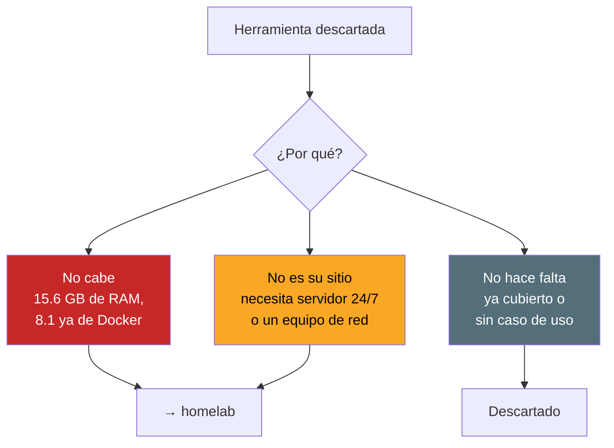
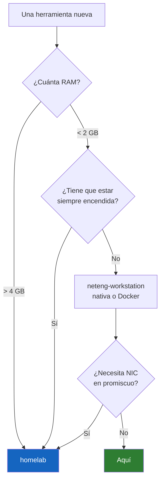

# 09 · Lo que NO está instalado

Y por qué, y cómo se usaría el día que haga falta.

Un inventario que solo lista lo que tienes está incompleto: lo que **decidiste no instalar** dice más sobre cómo trabajas que lo que instalaste sin pensar.

---

## Por qué no está: tres motivos distintos



---

## No cabe: límite de RAM

### Malcolm

Suite de la CISA que junta Zeek, Suricata, Arkime y OpenSearch en un `docker-compose`, con los dashboards ya hechos. Le das un PCAP y te devuelve el análisis.

**Pide 16 GB dedicados.** Hay 15.6 en total y 8.1 son de Docker. No es cuestión de optimizar: no entra.

Cómo se usaría:

```bash
git clone https://github.com/cisagov/Malcolm
cd Malcolm && ./scripts/install.py
./scripts/start
# subir PCAP a ./pcap/upload/ y consultar en https://localhost
```

→ [homelab](https://github.com/marksato13/homelab)

### Arkime

Full packet capture indexado. OpenSearch por debajo y disco sin fondo: la retención se mide en terabytes.

### Wazuh

SIEM + HIDS. Manager, indexer y dashboard suman **8 GB mínimo**. Además es un servidor: tiene que estar encendido para recibir los agentes.

---

## No es su sitio: servicios 24/7

Un portátil se suspende, cambia de red y se apaga. Nada que deba estar disponible siempre vive aquí.

| Herramienta | Qué hace | Dónde va |
|---|---|---|
| **Zabbix** | Monitorización con umbrales y alertas | homelab |
| **LibreNMS** | Autodescubrimiento SNMP y gráficas | homelab |
| **NetBox** | IPAM + DCIM, fuente de verdad | homelab (en el portátil solo para aprender) |
| **Ansible** | Cambios de configuración en lote | Bastión Linux con IP estable |

**Ansible merece explicación aparte.** No corre nativo en Windows, pero eso es lo de menos. El motivo real es que un playbook a medio ejecutar —porque el portátil se suspendió o cambió de WiFi— deja la infraestructura en un estado indefinido. Para practicar: `sudo apt install -y ansible` en WSL.

---

## No es su sitio: corre en el equipo de red

Estas no se instalan en ningún PC.

| Proyecto | Dónde vive |
|---|---|
| [eworm-de/routeros-scripts](https://github.com/eworm-de/routeros-scripts) | Dentro del MikroTik |
| [beeyev/Mikrotik-RouterOS-automatic-backup-and-update](https://github.com/beeyev/Mikrotik-RouterOS-automatic-backup-and-update) | Dentro del MikroTik |
| [theinvisible/openfortigui](https://github.com/theinvisible/openfortigui) | Cliente SSL-VPN **para Linux**. En Windows se usa FortiClient |

---

## Pendiente de instalar: sí caben

Estas tres sí funcionarían en el portátil. Están en la lista corta.

### Oxidized

Backup de configuraciones con **histórico en Git**. Hace pull por SSH, detecta cambios y los versiona. Cuando algo se rompe, un `git diff` dice exactamente qué cambió y cuándo.

```bash
docker run --rm -v "$PWD/oxidized:/root/.config/oxidized" \
    -p 8888:8888 oxidized/oxidized:latest
```

Es la mejora más rentable del inventario actual: ~200 MB y resuelve un trabajo que hoy hago a mano.

### Batfish

**Valida configuraciones antes de aplicarlas.** Lee las configs, construye un modelo de la red y responde preguntas del tipo «¿puede el host A llegar al puerto 443 de B?» sin tocar un equipo.

```bash
docker run --rm -p 9997:9997 -p 9996:9996 batfish/allinone
```

```python
from pybatfish.client.session import Session
bf = Session(host="localhost")
bf.set_network("prod"); bf.init_snapshot("./configs", name="snap")
bf.q.reachability(pathConstraints=PathConstraints(startLocation="host1")).answer()
```

Pasas de «aplico y veo qué pasa» a «simulo y confirmo».

### tftpd64

TFTP + DHCP + syslog en un binario portable. <https://pjo2.github.io/tftpd64/>

Para **subir firmware** a un switch Cisco sigue haciendo falta un TFTP de verdad; Oxidized solo descarga.

```
# en el switch
copy tftp://192.0.2.100/imagen.bin flash:
```

---

## Descartado por decisión

| | Por qué |
|---|---|
| **GNS3 / VirtualBox** | Al homelab. Un emulador de topologías compitiendo por 15.6 GB no rinde |
| **Terraform** | Sin caso de uso. Para on-premise no aporta sobre Ansible |
| **FileZilla** | WinSCP ya cubre SFTP/SCP con editor remoto y sincronización |
| **WinMTR** | Abandonado desde 2015. `mtr` en WSL está mantenido |
| **Zabbix agent local** | Tiene sentido en los servidores, no en el portátil |
| **Herramientas ofensivas** | Van en una VM aislada y desechable con snapshot, nunca en la máquina de diario |

---

## Dónde está la frontera

Un resumen de la lógica completa:



Ese último criterio es el que separa **analizar un PCAP** (cabe aquí) de **capturar en vivo** (necesita puerto espejo y NIC dedicada, o sea homelab).
