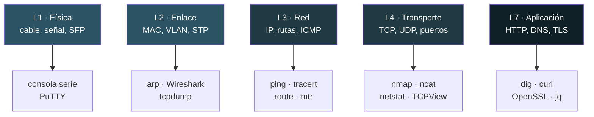
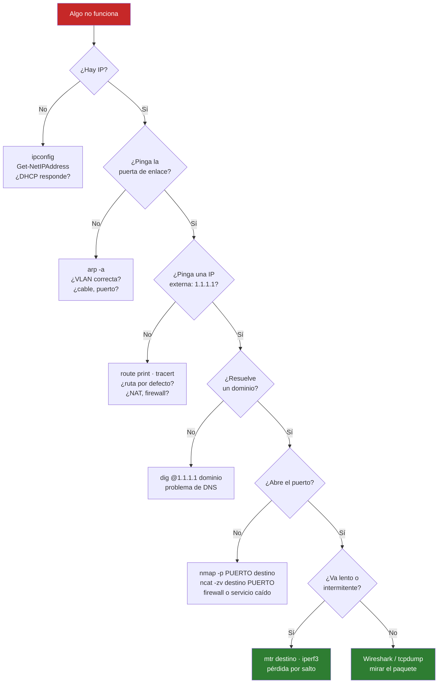

# Herramientas: cómo funcionan y cómo se usan

Una guía por herramienta: **qué hace por dentro**, cuándo sacarla y comandos reales. No es una lista de flags — para eso está `--help`.

| Documento | Herramientas |
|---|---|
| [01 · Acceso a equipos](01-acceso.md) | SSH · PuTTY · WinSCP · Tabby |
| [02 · Diagnóstico de red](02-diagnostico.md) | ping · tracert · pathping · mtr · dig · netstat · arp · route · iperf3 |
| [03 · Captura y análisis](03-captura.md) | Npcap · Wireshark · tshark · tcpdump |
| [04 · Descubrimiento](04-descubrimiento.md) | nmap · ncat · psping |
| [05 · SNMP](05-snmp.md) | snmpwalk · snmpget · MIBs |
| [06 · Sistema](06-sistema.md) | TCPView · Process Explorer · PsTools |
| [07 · Datos y criptografía](07-datos-cripto.md) | jq · OpenSSL · curl |
| [08 · Automatización](08-automatizacion.md) | Python · netmiko · napalm · nornir · Ansible |
| [09 · Lo que NO está instalado](09-no-instalado.md) | Y por qué, y cómo se usaría |

---

## Dónde actúa cada herramienta

Las herramientas no se eligen por gusto: cada una mira una capa distinta. Si no sabes en qué capa está el problema, no sabes qué abrir.

---

## Árbol de decisión: «no funciona»

El orden importa. Subir capa por capa evita perder media hora mirando el sitio equivocado.

**La regla de oro:** captura el tráfico (paso N) **al final**, no al principio. Wireshark te dará 40 000 paquetes y ninguna pista si no sabes qué buscas.

---

## Qué herramienta para qué pregunta

| La pregunta | La herramienta |
|---|---|
| ¿Llega el paquete? | `ping` |
| ¿Por dónde va y dónde se pierde? | `tracert`, `mtr` |
| ¿Cuánto ancho de banda hay de verdad? | `iperf3` |
| ¿A qué IP resuelve esto y quién lo dice? | `dig` |
| ¿Está el puerto abierto? | `nmap`, `ncat` |
| ¿Qué hay en esta red? | `nmap -sn` |
| ¿Qué proceso tiene ese puerto abierto? | `TCPView`, `netstat` |
| ¿Qué se están diciendo exactamente? | `Wireshark`, `tcpdump` |
| ¿Cuánto tráfico pasa por esa interfaz? | `snmpwalk` |
| ¿Es válido este certificado? | `openssl s_client` |
| ¿Qué devuelve la API del firewall? | `curl` + `jq` |
| ¿Cómo aplico esto a 50 switches? | `netmiko`, `nornir` |
